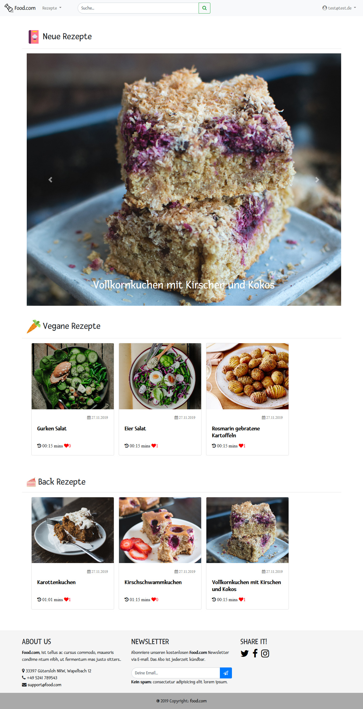
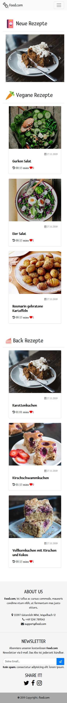
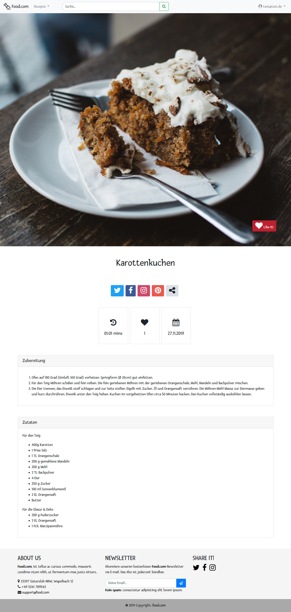
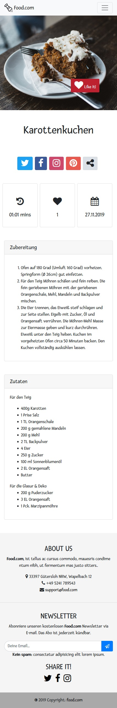

# Website

  

# Intro
Dieses Projekt ist eine Koch-Website erstellt in Symfony 4.

# Desktop

  

# Mobile

  

# Desktop Rezept Seite

  

# Mobile second page

  

# Features
 * Backend mit Authentifizierungsmöglichkeit und Pflege des Contents mithilfe eines eingebetteten Editors
 * Responsive Webdesign
 * Asynchrone Suchmöglichkeit

# Sprachen
Das Projekt wurde mithilfe folgender Sprachen/Frameworks und Bibliotheken realisiert:
 
 * HTML 5
 * CSS 3
 * JavaScript ES6
 * JQuery
 * MySQL
 * PHP (Symfony 4 Framework)
 * Bootstrap 4